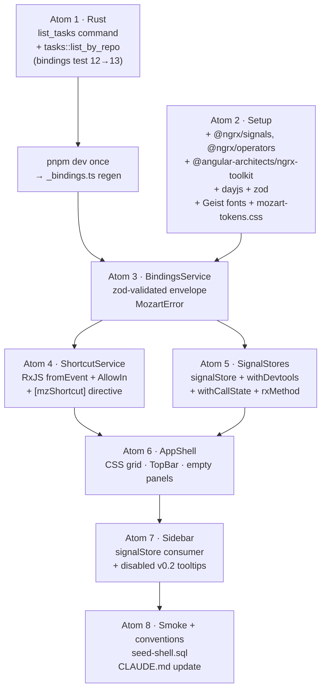

# Plan: Step 1.8a — Angular shell foundation + sidebar reading surface (v2)

**Spec source:** `docs/PLAN-v0.0.1.md` § Step 1.8 (lines 484–499); `docs/DESIGN.md` § Layout / Color Tokens / Typography / Sidebar Interaction Patterns / Accessibility / Component States.
**Plan 1 of 4** for Step 1.8. Plans 09 (stream + composer), 10 (diff panel), 11 (dialogs + settings + sidebar interaction) follow.

> **Revision note.** v1 of this plan used bare `@Injectable` + `signal()` stores, planned shared-styles-theme edits for app-specific tokens, and skipped keyboard infrastructure. v2 adopts `@ngrx/signals` + `@angular-architects/ngrx-toolkit` (SignalStore + withDevtools + withCallState + rxMethod), ships a dedicated `ShortcutService` (RxJS / `fromEvent` / `AllowIn`), keeps everything in `apps/desktop/` (no new libs), validates the Rust↔Angular bridge with `zod`, forbids `any`, and writes the codebase conventions into `CLAUDE.md`.

---

## Context

After Step 1.7 the Tauri backend exposes 12 typed commands. The Angular app still shows the `ButtonPreview` smoke component. Mozart cannot ship without a real shell. This plan stands up:

- the dark 3-panel layout + Mozart token surface;
- a typed `BindingsService` validated by `zod` at the IPC boundary;
- three `signalStore()` definitions (`ProjectStore`, `TaskStore`, `WorkspaceStore`) with `rxMethod` async loaders, `withCallState`, `withDevtools` (dev-only);
- a `ShortcutService` (RxJS-based) + `[mzShortcut]` directive consumed by later plans for `⌘N`, `⌘.`, etc.;
- the read-only Sidebar (projects + workspaces, `tasks.title` primary, `branch_name` mono subtitle, status dot);
- an Angular conventions section in `CLAUDE.md` capturing every rule introduced.

After this plan ships, `pnpm dev` boots Mozart into the dark shell with the empty-state sidebar card on empty DB, and renders projects + workspaces with status badges when the seed SQL fixture is loaded.

---

## Shape of the change



Data flow (functional, signals-first):

```
Rust commands ── BindingsService(zod) ──► MozartError | T
                              │
                              ▼
   ProjectStore   TaskStore   WorkspaceStore         ShortcutService
   (signalStore + withCallState + withDevtools)      (RxJS fromEvent$)
        │                                                  │
        ▼                                                  ▼
        ┌─────────── AppShell template ───────────┐  [mzShortcut]
        Sidebar / Center / Right (read-only v0.8a)    directive
```

---

## Verified repo truths (delta vs. v1)

All v1 truths still hold. Added:

- **No `@ngrx/*` deps installed yet** (`package.json:53-72`); the install is the first sub-step of atom 2.
- **No `dayjs`, no `zod` installed yet** — both added in atom 2.
- **`apps/desktop/public/`** is the asset glob root (`apps/desktop/project.json:18-22`). Mozart-specific font files and CSS go in `apps/desktop/` — no `libs/` edits in this plan.
- **`CLAUDE.md:84-119`** already documents Angular conventions (DI via `inject()`, signals-first, `readonly`/`protected`, kebab-case, feature folders). Atom 8 appends a "State management" + "Shortcuts" + "Validation (zod)" + "TDD" section without rewriting what's already there.
- **`apps/desktop/src-tauri/src/commands/mod.rs:406-437`** ships `seed_workspace_chain(db, repo_id)` — reused by atom 1's `list_tasks` tests.
- **`libs/ui/scroll-area/src/lib/hlm-scroll-area.ts:5`** selector is `ng-scrollbar[hlm]`, **not** a custom element. Sidebar uses `<ng-scrollbar hlm>`.

---

## Architecture decisions

- **D1 — `@ngrx/signals` SignalStore for app state.** All three stores (`ProjectStore`, `TaskStore`, `WorkspaceStore`) are built via `signalStore({ providedIn: 'root' }, withDevtools(name), withCallState({ collection: '…' }), withState(...), withMethods((store, b = inject(BindingsService)) => ({ … })), withComputed(...), withHooks({ onInit: ... }))`. Async loaders use `rxMethod<void>(pipe(switchMap(() => from(b.listRepos()).pipe(tapResponse({ next, error, finalize })))))`. This follows the [angular-architects/flights42](https://github.com/angular-architects/flights42) + ngrx-toolkit demo store patterns; functional composition replaces the object-oriented `@Injectable` class. Plain `@Injectable` stays for stateless utilities (`BindingsService`, `ShortcutService`).
- **D2 — `withCallState` from `@angular-architects/ngrx-toolkit`** replaces the hand-rolled `_status` / `_error` signals. It exposes `loading()`, `loaded()`, `error()` computed signals per collection — the Sidebar reads these directly.
- **D3 — `withDevtools(name)` is added unconditionally; no-op in production.** The toolkit's devtools feature is a tree-shakable wrapper that becomes a no-op when Redux Devtools are absent. Names: `'projects'`, `'tasks'`, `'workspaces'`.
- **D4 — `BindingsService` validates IPC responses with `zod` at the boundary.** Each command's return shape is described by a `z.object({...})` schema. `wrap<T>(p, schema)` parses-or-throws. The `AppError` rust enum maps to a `MozartError` class with `kind`, `message`, optional `recovery`. **Zero `any`** — schemas drive types via `z.infer`.
- **D5 — `ShortcutService` is RxJS-based with the user-specified API.** Public surface: `register(input: ShortcutInput): () => void` (returns dispose callback), `register$(input: ShortcutInput): Observable<ShortcutEventOutput>`, `pressed$(key: string): Observable<KeyboardEvent>`. Internally a single `fromEvent(document, 'keydown')` upstream filtered per registration. Improvements vs. the reference API: (a) `key: 'all'` matches every keydown — useful for command palette priming in v0.2; (b) `key: ['ctrl+k', 'cmd+k']` array shape resolves the platform-prefix at registration time (so consumers don't repeat platform branching); (c) `throttleTime` defaults to `0`, but when set, applies `throttleTime(ms, asyncScheduler, { leading: true, trailing: false })`; (d) `allowIn` defaults to `[]` (block in inputs); (e) dispose via `() => void` instead of a separate `unregister`.
- **D6 — `[mzShortcut]` directive** wraps `register$` for template-driven registration on a specific host element (`target` becomes `this.elementRef.nativeElement` automatically). Used in plans 09 + 11; ships in atom 4 so directives consume a stable surface.
- **D7 — No new NX libs.** Per request: everything mozart-specific lives in `apps/desktop/src/app/` (or `apps/desktop/src/styles/` for global CSS, or `apps/desktop/public/fonts/` for binaries). A later "split into libs" PR can extract reusable bits. Concretely:
  - `apps/desktop/src/app/state/` — signalStores.
  - `apps/desktop/src/app/services/` — `bindings.service.ts`, `shortcut.service.ts`, `mozart-error.ts`.
  - `apps/desktop/src/app/shared/schemas/` — zod schemas for `_bindings.ts` types.
  - `apps/desktop/src/app/shared/keyboard/` — `Shortcut` interface, `AllowIn` enum, `mzShortcut` directive.
  - `apps/desktop/src/styles/mozart-tokens.css` — Mozart color/layout/typography tokens, imported by `styles.css`.
  - `apps/desktop/public/fonts/` — Geist Variable + Geist Mono Variable woff2.
- **D8 — Mozart tokens go in `apps/desktop/src/styles/mozart-tokens.css`, NOT in `libs/shared-styles-theme`.** The lib only owns the Spartan zinc palette. Mozart's app-specific tokens (`--bg-app`, `--bg-sidebar`, font vars, status hues) live in the app. `apps/desktop/src/styles.css` adds one `@import './styles/mozart-tokens.css';` line. `libs/shared-styles-theme` is untouched.
- **D9 — Dark-only via `provideTheme({ mode: 'dark' })`.** `ThemeService.applyClasses()` handles `html.dark` + `body.theme-zinc`. No body-class hardcoding in `index.html`. Mozart tokens scope themselves under `:root.dark` to match.
- **D10 — 13th Rust command `list_tasks(repo_id) → Vec<Task>` is added** (unchanged from v1).
- **D11 — Workspace label = `tasks.title` (primary) + `branch_name` (subtitle)** (unchanged).
- **D12 — Disabled v0.2/1.8d controls show Spartan Tooltips** (unchanged).
- **D13 — Routes: `''` → `AppShellComponent`; delete `ButtonPreview`** (unchanged).
- **D14 — F-task headroom**: `WorkspaceStore` keys by `task_id` as `Map<task_id, Workspace[]>` (unchanged).
- **D15 — TDD ordering: spec file first, then implementation.** Atoms 3, 4, 5, 7 each begin by writing failing vitest specs that describe the public API surface, then ship the implementation that makes them pass. The atomizer encodes this as a single atom per layer (spec + impl ship together as one reviewable unit), and the implementer follows the red-green discipline inside the atom.
- **D16 — Strict typing, never `any`.** Every signature is explicit. `BindingsService.wrap` is generic + schema-validated. The Rust→TS envelope union is `{ status: 'ok'; data: unknown } | { status: 'error'; error: unknown }`, narrowed by zod parses. Spec files cast through `unknown` (never `any`) when needed.
- **D17 — Functional approach.** No classes for stores (signalStore is a factory function). Components stay small (standalone, inline templates). Reach for `pipe()`, `computed()`, `effect()` before reaching for OOP scaffolding.
- **D18 — `PlatformService` deferred to plan 11** (unchanged from v1).
- **D19 — `dayjs` is added now even though plan 08 has no date rendering.** Reason: locking the date lib early prevents plan 09's stream timestamps from importing native `Intl` or another lib by accident. Plan 08 imports nothing from dayjs; atom 2 just registers the dep.
- **D20 — `_bindings.ts` regeneration is a one-shot manual step between atoms 1 and 3** (unchanged from v1, still acceptable for v0.0.1).

---

## Files

### Create

**Rust:** _(none — atom 1 only edits existing files)_

**Assets:**

- `apps/desktop/public/fonts/GeistVariableVF.woff2` (vendor from https://github.com/vercel/geist-font, OFL)
- `apps/desktop/public/fonts/GeistMonoVariableVF.woff2`

**Styles (app, not lib):**

- `apps/desktop/src/styles/mozart-tokens.css`

**Angular — services:**

- `apps/desktop/src/app/services/bindings.service.ts`
- `apps/desktop/src/app/services/bindings.service.spec.ts`
- `apps/desktop/src/app/services/shortcut.service.ts`
- `apps/desktop/src/app/services/shortcut.service.spec.ts`
- `apps/desktop/src/app/services/mozart-error.ts`

**Angular — shared:**

- `apps/desktop/src/app/shared/schemas/bindings.schemas.ts` _(zod schemas for `AppError`, `Repo`, `Task`, `Workspace`, etc.)_
- `apps/desktop/src/app/shared/schemas/bindings.schemas.spec.ts`
- `apps/desktop/src/app/shared/keyboard/shortcut.types.ts` _(`AllowIn` enum, `Shortcut`, `ShortcutInput`, `ShortcutEventOutput`)_
- `apps/desktop/src/app/shared/keyboard/mz-shortcut.directive.ts`
- `apps/desktop/src/app/shared/keyboard/mz-shortcut.directive.spec.ts`
- `apps/desktop/src/app/shared/keyboard/key-combo.ts` _(pure functions: `normalizeKey`, `resolvePlatform`, `matchesEvent`)_
- `apps/desktop/src/app/shared/keyboard/key-combo.spec.ts`

**Angular — state (signalStores):**

- `apps/desktop/src/app/state/project.store.ts`
- `apps/desktop/src/app/state/project.store.spec.ts`
- `apps/desktop/src/app/state/task.store.ts`
- `apps/desktop/src/app/state/task.store.spec.ts`
- `apps/desktop/src/app/state/workspace.store.ts`
- `apps/desktop/src/app/state/workspace.store.spec.ts`

**Angular — shell:**

- `apps/desktop/src/app/shell/app-shell.component.ts`
- `apps/desktop/src/app/shell/top-bar.component.ts`
- `apps/desktop/src/app/shell/empty-center.component.ts`
- `apps/desktop/src/app/shell/empty-right.component.ts`

**Angular — sidebar:**

- `apps/desktop/src/app/sidebar/sidebar.component.ts`
- `apps/desktop/src/app/sidebar/sidebar.component.spec.ts`
- `apps/desktop/src/app/sidebar/project-row.component.ts`
- `apps/desktop/src/app/sidebar/workspace-item.component.ts`
- `apps/desktop/src/app/sidebar/workspace-item.component.spec.ts`
- `apps/desktop/src/app/sidebar/sidebar-empty.component.ts`
- `apps/desktop/src/app/sidebar/sidebar-error.component.ts`
- `apps/desktop/src/app/sidebar/sidebar-skeleton.component.ts`

**Smoke fixture:**

- `apps/desktop/src-tauri/tests/fixtures/seed-shell.sql`

### Modify

- `package.json` — add deps: `@ngrx/signals`, `@ngrx/operators`, `@angular-architects/ngrx-toolkit`, `dayjs`, `zod`. Versions: pick latest compatible with Angular 21 (`@ngrx/signals` ^21, `@angular-architects/ngrx-toolkit` ^21, `@ngrx/operators` ^21, `zod` ^4, `dayjs` ^1.11). The implementer runs `pnpm add <list>` and commits the lockfile update.
- `apps/desktop/src/styles.css` — append `@import "./styles/mozart-tokens.css";` after the existing theme import.
- `apps/desktop/src/index.html` — add two `<link rel="preload" as="font" type="font/woff2" crossorigin href="/fonts/...">` lines before `<link rel="icon">`. **No body class change.**
- `apps/desktop/src/app/app.config.ts` — `provideTheme()` → `provideTheme({ mode: 'dark' })`.
- `apps/desktop/src/app/app.routes.ts` — replace `ButtonPreview` route with `loadComponent` → `AppShellComponent`.
- `apps/desktop/src-tauri/src/db/tasks.rs` — add `pub fn list_by_repo(conn, repo_id) -> Result<Vec<Task>, AppError>` + tests.
- `apps/desktop/src-tauri/src/commands/mod.rs` — add `list_tasks` + `list_tasks_impl` after `list_workspaces`; add two `#[tokio::test]`s.
- `apps/desktop/src-tauri/src/bindings_export.rs` — register `commands::list_tasks` in `collect_commands!`.
- `apps/desktop/src-tauri/tests/bindings_export.rs:35-48` — append `"listTasks"` to `expected_commands`; update count comment.
- `CLAUDE.md` — append a "State management (signalStore)", "Keyboard shortcuts", "IPC validation (zod)", "TDD discipline", "Forbidden patterns" section. (Atom 8.)

### Delete

- `apps/desktop/src/app/component.ts` (`ButtonPreview` placeholder).

### Untouched (despite v1 proposing edits)

- `libs/shared-styles-theme/src/lib/themes/zinc.css` — Mozart tokens moved out per D7/D8.
- `libs/shared-styles-theme/src/lib/base.css` — same reason. `@font-face` declarations live in `apps/desktop/src/styles/mozart-tokens.css`.

---

## Key pseudocode

### `apps/desktop/src/app/shared/schemas/bindings.schemas.ts` (zod boundary)

```ts
import { z } from 'zod';

export const AppErrorSchema = z.object({
  kind: z.enum(['Db', 'Io', 'NotFound', 'Validation', 'AgentSpawn', 'GitCmd']),
  message: z.string(),
});
export type AppErrorDto = z.infer<typeof AppErrorSchema>;

export const RepoSchema = z.object({
  repo_id: z.string().min(1),
  path: z.string().min(1),
  display_name: z.string(),
  added_at: z.number().int().nonnegative(),
});
export type RepoDto = z.infer<typeof RepoSchema>;

export const TaskSchema = z.object({
  task_id: z.string().min(1),
  repo_id: z.string().min(1),
  title: z.string(),
  task_text: z.string(),
  status: z.enum(['active', 'archived']),
  created_at: z.number().int().nonnegative(),
});
export type TaskDto = z.infer<typeof TaskSchema>;

export const WorkspaceStatusSchema = z.enum([
  'initializing', 'ready', 'running', 'done',
  'error', 'conflict', 'stopped', 'crashed',
]);
export type WorkspaceStatus = z.infer<typeof WorkspaceStatusSchema>;

export const WorkspaceSchema = z.object({
  workspace_id: z.string().min(1),
  task_id: z.string().min(1),
  worktree_path: z.string(),
  branch_name: z.string(),
  base_branch: z.string(),
  status: WorkspaceStatusSchema,
  created_at: z.number().int().nonnegative(),
  deletion_intent: z.number().int(),
});
export type WorkspaceDto = z.infer<typeof WorkspaceSchema>;

// Whitelist: any unknown fields are stripped at parse time (zod strict mode).
```

### `apps/desktop/src/app/services/mozart-error.ts`

```ts
import type { AppErrorDto } from '../shared/schemas/bindings.schemas';

export class MozartError extends Error {
  readonly kind: AppErrorDto['kind'];
  readonly recovery?: string;
  constructor(kind: AppErrorDto['kind'], message: string, recovery?: string) {
    super(message);
    this.name = 'MozartError';
    this.kind = kind;
    this.recovery = recovery;
  }
  static fromAppError(e: AppErrorDto): MozartError {
    const recovery = e.kind === 'AgentSpawn'
      ? 'Open Settings → Claude CLI' : undefined;
    return new MozartError(e.kind, e.message, recovery);
  }
}
```

### `apps/desktop/src/app/services/bindings.service.ts`

```ts
import { Injectable } from '@angular/core';
import { z } from 'zod';
import { commands, type ClaudeInstall } from '../_bindings';
import {
  AppErrorSchema, RepoSchema, TaskSchema, WorkspaceSchema,
  type RepoDto, type TaskDto, type WorkspaceDto,
} from '../shared/schemas/bindings.schemas';
import { MozartError } from './mozart-error';

const OkEnvelope = <T>(data: z.ZodType<T>) =>
  z.object({ status: z.literal('ok'), data });
const ErrEnvelope =
  z.object({ status: z.literal('error'), error: AppErrorSchema });
const Envelope = <T>(data: z.ZodType<T>) =>
  z.discriminatedUnion('status', [OkEnvelope(data), ErrEnvelope]);

@Injectable({ providedIn: 'root' })
export class BindingsService {
  private async invoke<T>(
    raw: Promise<unknown>,
    schema: z.ZodType<T>,
  ): Promise<T> {
    const value = await raw;
    // tauri-specta v2 may emit a tagged envelope OR a throwing Promise<T>.
    // We try envelope first; fall back to schema-direct for raw payloads.
    const env = Envelope(schema).safeParse(value);
    if (env.success) {
      if (env.data.status === 'ok') return env.data.data;
      throw MozartError.fromAppError(env.data.error);
    }
    const direct = schema.safeParse(value);
    if (direct.success) return direct.data;
    throw new MozartError(
      'Validation',
      `IPC payload failed validation: ${env.error.message}`,
    );
  }

  listRepos = (): Promise<RepoDto[]> =>
    this.invoke(commands.listRepos(), z.array(RepoSchema));
  listTasks = (repoId: string): Promise<TaskDto[]> =>
    this.invoke(commands.listTasks(repoId), z.array(TaskSchema));
  listWorkspaces = (): Promise<WorkspaceDto[]> =>
    this.invoke(commands.listWorkspaces(), z.array(WorkspaceSchema));
  // plan 09+ consumers (declared now, untested in plan 08):
  addRepo = (path: string): Promise<RepoDto> =>
    this.invoke(commands.addRepo(path), RepoSchema);
  archiveWorkspace = (id: string): Promise<void> =>
    this.invoke(commands.archiveWorkspace(id), z.void());
  checkClaudeInstall = (): Promise<ClaudeInstall> =>
    commands.checkClaudeInstall(); // already typed by tauri-specta
}
```

### `apps/desktop/src/app/shared/keyboard/shortcut.types.ts`

```ts
export const AllowIn = {
  Textarea: 'TEXTAREA',
  Input: 'INPUT',
  Select: 'SELECT',
} as const;
export type AllowIn = (typeof AllowIn)[keyof typeof AllowIn];

export interface ShortcutEventOutput {
  readonly event: KeyboardEvent;
  readonly key: string | readonly string[];
}

export interface Shortcut {
  /** Key combo. Use `'all'` to match every keydown (e.g. command palette priming). */
  readonly key: string | readonly string[] | 'all';
  readonly command: (event: ShortcutEventOutput) => void;
  readonly description?: string;
  readonly throttleTime?: number;
  readonly label?: string;
  readonly preventDefault?: boolean;
}

export interface ShortcutInput extends Shortcut {
  /** Allow firing while focus is inside these node types. Default: blocked in all. */
  readonly allowIn?: readonly AllowIn[];
  /** Only fire when target (or a descendant) has focus. Defaults to document. */
  readonly target?: HTMLElement;
}
```

### `apps/desktop/src/app/services/shortcut.service.ts`

```ts
import { DOCUMENT } from '@angular/common';
import { Injectable, inject } from '@angular/core';
import { Observable, Subject, fromEvent, merge } from 'rxjs';
import { filter, finalize, share, takeUntil, throttleTime } from 'rxjs/operators';

import type {
  Shortcut, ShortcutEventOutput, ShortcutInput,
} from '../shared/keyboard/shortcut.types';
import { AllowIn } from '../shared/keyboard/shortcut.types';
import {
  matchesEvent, normalizeKey, resolvePlatform,
} from '../shared/keyboard/key-combo';

@Injectable({ providedIn: 'root' })
export class ShortcutService {
  private readonly doc = inject(DOCUMENT);
  private readonly platform = resolvePlatform(this.doc.defaultView);
  private readonly keydown$ = fromEvent<KeyboardEvent>(this.doc, 'keydown')
    .pipe(share());

  /** Register and return an Observable that emits each match. */
  register$(input: ShortcutInput): Observable<ShortcutEventOutput> {
    const keys = this.collectKeys(input.key);
    const allowIn = new Set<AllowIn>(input.allowIn ?? []);
    const target$ = input.target
      ? fromEvent<KeyboardEvent>(input.target, 'keydown')
      : this.keydown$;
    const stream$ = target$.pipe(
      filter((event) => !this.isBlockedByFocus(event, allowIn)),
      filter((event) =>
        input.key === 'all' || keys.some((k) => matchesEvent(k, event, this.platform)),
      ),
      input.throttleTime
        ? throttleTime(input.throttleTime, undefined, { leading: true, trailing: false })
        : (s) => s,
    );
    return new Observable<ShortcutEventOutput>((subscriber) => {
      const sub = stream$.subscribe((event) => {
        if (input.preventDefault) event.preventDefault();
        subscriber.next({ event, key: input.key });
      });
      return () => sub.unsubscribe();
    });
  }

  /** Imperative register; returns a dispose callback. */
  register(input: ShortcutInput): () => void {
    const stop$ = new Subject<void>();
    this.register$(input)
      .pipe(takeUntil(stop$))
      .subscribe((out) => input.command(out));
    return () => { stop$.next(); stop$.complete(); };
  }

  private collectKeys(key: Shortcut['key']): string[] {
    if (key === 'all') return [];
    if (Array.isArray(key)) return key.map(normalizeKey);
    return [normalizeKey(key as string)];
  }

  private isBlockedByFocus(event: KeyboardEvent, allowIn: Set<AllowIn>): boolean {
    const target = event.target;
    if (!(target instanceof HTMLElement)) return false;
    const tag = target.tagName as AllowIn;
    if (tag === AllowIn.Textarea || tag === AllowIn.Input || tag === AllowIn.Select) {
      return !allowIn.has(tag);
    }
    return false;
  }
}
```

`key-combo.ts` exports pure functions — `normalizeKey('ctrl+k') → { mod: true, shift: false, alt: false, key: 'k' }`, `resolvePlatform(window) → 'mac' | 'other'`, `matchesEvent(combo, event, platform) → boolean`. Each function has a `.spec.ts` test, written first per D15.

### `apps/desktop/src/app/state/project.store.ts`

```ts
import { computed, inject } from '@angular/core';
import { tapResponse } from '@ngrx/operators';
import { signalStore, withComputed, withHooks, withMethods, withState } from '@ngrx/signals';
import { rxMethod } from '@ngrx/signals/rxjs-interop';
import { withCallState, withDevtools } from '@angular-architects/ngrx-toolkit';
import { from, pipe } from 'rxjs';
import { switchMap, tap } from 'rxjs/operators';

import { BindingsService } from '../services/bindings.service';
import { MozartError } from '../services/mozart-error';
import type { RepoDto } from '../shared/schemas/bindings.schemas';

interface ProjectState {
  readonly projects: readonly RepoDto[];
  readonly selectedProjectId: string | null;
  readonly expandedProjectIds: ReadonlySet<string>;
  readonly errorDetail: MozartError | null;
}

const initialState: ProjectState = {
  projects: [],
  selectedProjectId: null,
  expandedProjectIds: new Set(),
  errorDetail: null,
};

export const ProjectStore = signalStore(
  { providedIn: 'root' },
  withDevtools('projects'),
  withCallState({ collection: 'projects' }),
  withState(initialState),
  withComputed((state) => ({
    selectedProject: computed(() =>
      state.projects().find((p) => p.repo_id === state.selectedProjectId()) ?? null,
    ),
  })),
  withMethods((store, bindings = inject(BindingsService)) => ({
    refresh: rxMethod<void>(
      pipe(
        tap(() => patchProjectsState(store, { errorDetail: null })),
        switchMap(() =>
          from(bindings.listRepos()).pipe(
            tapResponse({
              next: (projects) => patchProjectsState(store, {
                projects,
                expandedProjectIds: new Set(projects.map((p) => p.repo_id)),
                selectedProjectId: store.selectedProjectId() ?? projects[0]?.repo_id ?? null,
              }),
              error: (e: unknown) => patchProjectsState(store, {
                errorDetail: e instanceof MozartError ? e
                  : new MozartError('Db', 'Unexpected error loading projects'),
              }),
            }),
          ),
        ),
      ),
    ),
    select(id: string) { patchProjectsState(store, { selectedProjectId: id }); },
    toggleExpanded(id: string) {
      const next = new Set(store.expandedProjectIds());
      next.has(id) ? next.delete(id) : next.add(id);
      patchProjectsState(store, { expandedProjectIds: next });
    },
  })),
  withHooks({ onInit: (store) => store.refresh() }),
);

// Internal helper to centralise patchState calls + keep withDevtools action names readable.
function patchProjectsState(store: unknown, patch: Partial<ProjectState>): void {
  // patchState typed via @ngrx/signals (no `any`):
  // patchState(store, patch);
  // Pseudocode: real impl imports patchState and types `store` properly.
}
```

`TaskStore` mirrors with `withCallState({ collection: 'tasks' })`, `Map<repoId, TaskDto[]>` state, and a `refreshFor(repoId)` `rxMethod<string>` triggered by an `effect()` over `projects()` inside `withHooks({ onInit })`. `WorkspaceStore` mirrors with `withCallState({ collection: 'workspaces' })` + `byTask` computed `Map<task_id, Workspace[]>` (F3-safe).

### `apps/desktop/src/app/sidebar/workspace-item.component.ts`

Largely the same as v1; the only data-source difference is that `taskTitle` reads from `inject(TaskStore).entityMap()` style — but since we use `Map<task_id, TaskDto>` rather than ngrx-entities, the computed reads `inject(TaskStore).byId().get(...)?.title`.

---

## TDD ordering (D15)

Each atom containing a new TS module follows:

1. **Red.** Write the `.spec.ts` describing public surface (no `any`; cast through `unknown` if needed). Run `pnpm nx test desktop --testNamePattern=…` → fails.
2. **Green.** Write the minimal implementation; tests pass.
3. **Refactor.** Tighten types, extract pure helpers, ensure zod schemas remain the only `unknown → typed` boundary.

The implementer is expected to log the red/green transition in the atom completion message. Specs that target signalStores call `TestBed.configureTestingModule({ providers: [{ provide: BindingsService, useValue: createFakeBindings() }] })` and assert via `TestBed.inject(ProjectStore).projects()` etc. `createFakeBindings()` is a local helper inside each store spec; no shared fixture module needed in plan 08.

---

## Error handling

- **Rust:** unchanged from v1 (`AppError::Db` on SQLite failures).
- **Angular IPC:** `BindingsService.invoke` parses via zod and throws `MozartError` on either an `AppError` envelope or a schema mismatch (treated as `kind: 'Validation'`).
- **Stores:** `tapResponse({ error })` writes the `MozartError` into the store's `errorDetail` slot; `withCallState` automatically flips `error()` computed to truthy. Sidebar renders the inline `[Retry]` banner per DESIGN.md state matrix.
- **No toasts in plan 08** (toasts ship in plans 09 + 11).

---

## Atoms (consumed by `/atomize`)

Order: `1 → 2 → 3 → (4 ‖ 5) → 6 → 7 → 8`. Critical path length = 7.

1. **S1.8a.1 (Rust — list_tasks)** — `db/tasks.rs`, `commands/mod.rs`, `bindings_export.rs`, `tests/bindings_export.rs`. **Validation:** `cargo test -p app_lib` + `cargo clippy --all-targets -- -D warnings`.
2. **S1.8a.2 (Deps + tokens + fonts + index.html)** — `pnpm add @ngrx/signals @ngrx/operators @angular-architects/ngrx-toolkit dayjs zod`; create `apps/desktop/src/styles/mozart-tokens.css`; add font woff2 to `apps/desktop/public/fonts/`; edit `styles.css`, `index.html`, `app.config.ts`. **Validation:** `pnpm nx build desktop` green; preload tags present in built HTML; `dist/.../fonts/` contains both woff2 files.
3. **S1.8a.3 (Bindings regen + zod schemas + BindingsService + MozartError)** — _Pre-flight:_ run `pnpm dev` ~5s until `apps/desktop/src/app/_bindings.ts` exists with `listTasks`, Ctrl-C. Create `shared/schemas/bindings.schemas.ts` (+ spec), `services/mozart-error.ts`, `services/bindings.service.ts` (+ spec). **TDD:** schemas spec first; service spec second; impl third. **Validation:** `pnpm nx test desktop` green; `pnpm nx typecheck` green; `grep -r ': any' apps/desktop/src/app/services apps/desktop/src/app/shared` returns nothing.
4. **S1.8a.4 (ShortcutService + key-combo + directive)** — Create `shared/keyboard/shortcut.types.ts`, `shared/keyboard/key-combo.ts` (+ spec), `services/shortcut.service.ts` (+ spec), `shared/keyboard/mz-shortcut.directive.ts` (+ spec). Specs first per D15. **‖** with atom 5. **Validation:** `pnpm nx test desktop`; specs cover: combo normalization (`cmd+k` ↔ `ctrl+k` per platform), `allowIn` Input/Textarea blocking, `throttleTime` debouncing, `key: 'all'` wildcard.
5. **S1.8a.5 (SignalStores)** — Create three signalStores + three spec files. Specs first; each spec drives a fake `BindingsService` via `TestBed`. **Validation:** `pnpm nx test desktop` green; each store exposes `loading()`, `loaded()`, `error()` (via withCallState) and the expected `refresh()` / `select()` / `toggleExpanded()` API; no `: any` anywhere.
6. **S1.8a.6 (Shell)** — Create 4 shell components; swap routes; delete `component.ts`. **Validation:** `pnpm nx lint test build desktop` green.
7. **S1.8a.7 (Sidebar)** — Create 6 sidebar components + 2 spec files (sidebar + workspace-item). **Validation:** `pnpm nx lint test build desktop` green; visual check via `pnpm nx serve desktop` (browser-only) shows the dark shell and empty-state card.
8. **S1.8a.8 (Smoke + CLAUDE.md)** — Ship `seed-shell.sql`; append Angular conventions to `CLAUDE.md` (sections: State management with signalStore, Keyboard shortcuts, IPC validation with zod, TDD discipline, Forbidden patterns: `any`, `@Injectable` for new stateful services, library creation, `var()`-less status colors, eager subscribe without takeUntil). **Validation:** `pnpm nx run-many -t lint test`; `cargo test -p app_lib`; `pnpm dev` manual smoke (empty DB → empty card; seeded DB → projects + workspaces).

---

## CLAUDE.md additions (atom 8 draft)

Append a new section, after the existing "Angular best practices (functional style)" section:

### State management — `@ngrx/signals` SignalStore

- Stateful app code uses `signalStore({ providedIn: 'root' }, withDevtools(name), withCallState({ collection }), withState(initial), withMethods(...), withComputed(...), withHooks(...))`.
- Async loaders use `rxMethod<T>(pipe(switchMap(...), tapResponse({ next, error, finalize })))` — never raw `subscribe()` in store methods.
- Never reach for `@Injectable` + bare `signal()` for new stateful services. Stateless utilities (IPC wrappers, keyboard handlers, formatters) stay `@Injectable({ providedIn: 'root' })`.
- One store = one feature slice. Cross-store reads via `inject(OtherStore)` inside `withMethods` / `withComputed`.

### Keyboard shortcuts

- All keyboard bindings go through `ShortcutService` (`services/shortcut.service.ts`). Components call `register$(input)` and take until destroyed (`takeUntilDestroyed()`), or use `[mzShortcut]` template directive.
- `Shortcut` API: `key`, `command`, `description`, `throttleTime`, `label`, `preventDefault`. Use `allowIn` to fire inside inputs/textareas; default is blocked.
- `key: 'all'` matches every keydown — reserved for command-palette priming. Use sparingly.

### IPC validation — zod

- Every Tauri command response is parsed by a zod schema in `shared/schemas/`.
- DTOs derive from schemas via `z.infer<typeof X>` — never hand-typed parallel interfaces.
- Schema parse failures become `MozartError` with `kind: 'Validation'`; never surface raw zod errors to the UI.
- Forms (plan 11) declare a request DTO schema, parse user input, and reject with field-level errors before invoking IPC.

### TDD discipline

- Spec file is created **before** the implementation file for every new TS module under `apps/desktop/src/app/`. Red → Green → Refactor.
- Specs run via `pnpm nx test desktop`. Use `TestBed.configureTestingModule` for signalStores with fakes for cross-service deps.
- `_bindings.ts` is gitignored and regenerated on every `pnpm dev`. Specs that need it run after a manual regen step.

### Forbidden patterns

- `any` — use `unknown` + zod parse at the boundary.
- New NX libs for app-specific code — keep it in `apps/desktop/src/app/` until reuse from `apps/web` is real.
- `@Injectable` + raw `signal()` for app state — use `signalStore`.
- Eager `Observable.subscribe()` without `takeUntilDestroyed()` or `takeUntil(stop$)`.
- Hardcoded color hex in templates/styles — every color goes through `var(--mozart-token)`.
- Date math via raw `new Date()` — use `dayjs` (plan 09 onward; plan 08 ships the dep only).
- Free-form button labels in disabled v0.2 controls — every disabled control carries an `[hlmTooltip]` naming the milestone unblocking it (per DESIGN.md Rule 7).

---

## Verification

```sh
# Rust (atom 1, atom 8)
cd apps/desktop/src-tauri && cargo test -p app_lib
cd apps/desktop/src-tauri && cargo clippy --all-targets -- -D warnings

# Deps (atom 2)
pnpm install
pnpm nx build desktop

# _bindings.ts regeneration (atom 3 pre-flight)
pnpm dev   # wait until app window opens, Ctrl-C
test -f apps/desktop/src/app/_bindings.ts && grep -q "listTasks" apps/desktop/src/app/_bindings.ts

# Angular per atom
pnpm nx lint desktop
pnpm nx test desktop
pnpm nx build desktop
pnpm nx typecheck

# Strict-typing audit (atom 3 + 5 acceptance gate)
! grep -rEn ': any( |$|;|,|\))' apps/desktop/src/app/

# End-to-end smoke (atom 8)
pnpm dev
# expect: dark shell paints, Geist active, sidebar empty card.
sqlite3 "$XDG_DATA_HOME/com.mozart.desktop/mozart.db" \
  < apps/desktop/src-tauri/tests/fixtures/seed-shell.sql
# Click [Retry] in the sidebar → projects + workspaces with status dots.
```

---

## Rollback

- **Atom 1:** `git revert`. `_bindings.ts` is gitignored; no schema migration.
- **Atom 2:** `git revert` (drops deps + tokens + fonts). The new deps are additive; nothing else imports them yet.
- **Atoms 3–8:** `git revert` per atom. Stores, services, components are net-new and self-contained.

---

## Risks

- **R1 — `@ngrx/signals` Angular 21 compatibility.** Confirmed on npm: `@ngrx/signals@21` ships with Angular 21 support. If pnpm reports a peer-dep mismatch during atom 2, fall back to `@ngrx/signals@20` (still ships `signalStore`, `rxMethod`, `tapResponse` — feature-complete for plan 08). Atom 2 pins exact resolved versions in the lockfile to make later plans deterministic.
- **R2 — `_bindings.ts` envelope shape.** Same as v1 — atom 3 zod-parses both envelope and direct payload shapes, so either tauri-specta output works.
- **R3 — `withDevtools` in prod bundle.** The toolkit feature is tree-shakable; for belt-and-braces, atom 2's prod build is grep-checked for `__REDUX_DEVTOOLS_EXTENSION__` and the report attached to the atom. If it leaks, atom 5 swaps to `withDevtools(name, { disabled: !isDevMode() })`.
- **R4 — `pnpm add` lockfile churn.** Atom 2's commit includes `pnpm-lock.yaml` updates; reviewer should accept lockfile diffs as part of dependency adds, not gate the atom on them.
- **R5 — TDD overhead under deadline pressure.** D15 ordering adds 30–60 min per atom vs. write-then-test. The trade is intentional — specs catch IPC envelope regressions and signalStore wiring mistakes before they cascade into plans 09–11.

---

## Confidence

**8 / 10.** Decomposition follows the locked DESIGN.md state matrix, ngrx-toolkit's documented patterns ([flights42 demo store](https://github.com/angular-architects/ngrx-toolkit/blob/main/apps/demo/src/app/devtools/todo-store.ts), [withCallState](https://ngrx-toolkit.angulararchitects.io/docs/with-call-state)), and the existing Mozart conventions in `CLAUDE.md`. Two points docked: (a) `_bindings.ts` regen is still a manual `pnpm dev` step (automating it is a separate infra plan); (b) `@ngrx/signals@21` peer-dep with Angular 21.2 is confirmed by docs but not yet `pnpm install`-tested locally — atom 2 is the first run and an early failure mode.

Sources informing the revisions:

- [ngrx-toolkit todo-store demo](https://github.com/angular-architects/ngrx-toolkit/blob/main/apps/demo/src/app/devtools/todo-store.ts)
- [NgRx Toolkit docs — withDevtools / withCallState / withDataService](https://ngrx-toolkit.angulararchitects.io/)
- [NgRx Signals docs — SignalStore](https://ngrx.io/guide/signals/signal-store)
- [NgRx Operators — tapResponse](https://ngrx.io/guide/operators/operators)
- [angular-architects/flights42 reference repo](https://github.com/angular-architects/flights42)
